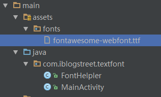

#App优化攻略-用TextView显示图片
在Android项目开发中，图片可谓是必不可少的一部分，这时我们可能会去看许多图片的适配方案，例如，根据不同分辨率来提供多套图什么的…

这篇文章并不是去介绍如何去做图片的适配，而是介绍一个略屌的字体库，利用该字体库，我们可以用TextView的形式去显示图片，而且我们还可以用android:textSize随意改变图片的大小！

##fontawesome的使用
下载地址 https://github.com/FortAwesome/Font-Awesome/

我们只需要这个文件fontawesome-webfont.ttf,将其拷贝到我们的工程目录下

我们定义一个字体操作类

	/*
	 *  @项目名：  TextFont 
	 *  @包名：    com.iblogstreet.textfont
	 *  @文件名:   FontHelpler
	 *  @创建者:   Army
	 *  @创建时间:  2016/9/17 8:16
	 *  @描述：    字体帮助类
	 */
	public class FontHelpler {
	    private static final String TAG = "FontHelpler";
	
	    public static final String FONTS_DIR="fonts/";
	    public static final String DEF_FONT=FONTS_DIR+ "fonts/fontawesome-webfont.ttf";
	    public static final void injectFont(View rootView){
	        injectFont(rootView,Typeface.createFromAsset(rootView.getContext().getAssets(),DEF_FONT));
	    }
	    public static  void injectFont(View rootView, Typeface tf){
	        if(rootView instanceof ViewGroup){
	            ViewGroup group=(ViewGroup)rootView;
	            int count=group.getChildCount();
	            for(int i=0;i<count;i++){
	                injectFont(group.getChildAt(i),tf);
	            }
	        }else if(rootView instanceof TextView){
	            ((TextView)rootView).setTypeface(tf);
	        }
	    }
	}

使用

	LinearLayout ll=(LinearLayout)findViewById(R.id.ll);
	FontHelpler.injectFont(ll);

最终效果图

文本与图片对照表

[对照表](http://fortawesome.github.io/Font-Awesome/cheatsheet/) http://fortawesome.github.io/Font-Awesome/cheatsheet/